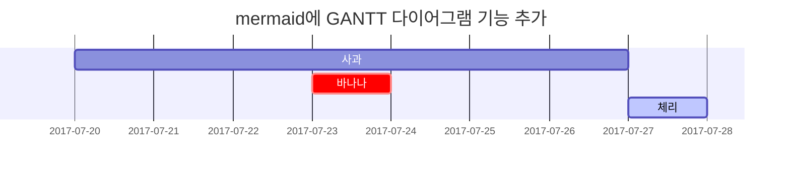

## 제목

<!-- markdownlint-capture -->
<!-- markdownlint-disable -->
# H1 — 제목
{: .mt-4 .mb-0 }

## H2 — 제목
{: data-toc-skip='' .mt-4 .mb-0 }

### H3 — 제목
{: data-toc-skip='' .mt-4 .mb-0 }

#### H4 — 제목
{: data-toc-skip='' .mt-4 }
<!-- markdownlint-restore -->

## 단락

Quisque egestas convallis ipsum, ut sollicitudin risus tincidunt a. Maecenas interdum malesuada egestas. Duis consectetur porta risus, sit amet vulputate urna facilisis ac. Phasellus semper dui non purus ultrices sodales. Aliquam ante lorem, ornare a feugiat ac, finibus nec mauris. Vivamus ut tristique nisi. Sed vel leo vulputate, efficitur risus non, posuere mi. Nullam tincidunt bibendum rutrum. Proin commodo ornare sapien. Vivamus interdum diam sed sapien blandit, sit amet aliquam risus mattis. Nullam arcu turpis, mollis quis laoreet at, placerat id nibh. Suspendisse venenatis eros eros.

## 리스트

### 순서가 있는 리스트

1. 첫째
2. 둘째
3. 셋째

### 순서가 없는 리스트

- 장
  - 절
    - 문단

### 할일 리스트

- [ ] 업무
  - [x] 1단계
  - [x] 2단계
  - [ ] 3단계

### 설명 리스트

태양
: 지구가 공전하는 별

달
: 태양 빛을 반사하여 보이는 지구의 자연 위성

## 인용문

> 이 줄은 _인용문_을 보여줍니다.

## 프롬프트

<!-- markdownlint-capture -->
<!-- markdownlint-disable -->
> `tip` 유형 프롬프트의 예시입니다.
{: .prompt-tip }

> `info` 유형 프롬프트의 예시입니다.
{: .prompt-info }

> `warning` 유형 프롬프트의 예시입니다.
{: .prompt-warning }

> `danger` 유형 프롬프트의 예시입니다.
{: .prompt-danger }
<!-- markdownlint-restore -->

## 표

| 회사                         | 연락처           | 국가 |
| :--------------------------- | :--------------- | ------: |
| Alfreds Futterkiste          | Maria Anders     | 독일 |
| Island Trading               | Helen Bennett    |      영국 |
| Magazzini Alimentari Riuniti | Giovanni Rovelli |   이탈리아 |

## 링크

<http://127.0.0.1:4000>

## 각주

후크를 클릭하면 각주[^footnote]로 이동하며, 여기 다른 각주[^fn-nth-2]가 있습니다.

## 인라인 코드

이것은 `인라인 코드`의 예시입니다.

## 파일 경로

여기 `/path/to/the/file.extend`{: .filepath}가 있습니다.

## 코드 블록

### 일반

```text
이것은 구문 강조와 줄 번호가 없는 일반적인 코드 스니펫입니다.
```

### 특정 언어

```bash
if [ $? -ne 0 ]; then
  echo "명령이 성공적이지 않았습니다.";
  #필요한 작업 수행 / 종료
fi;
```

### 특정 파일명

```sass
@import
  "colors/light-typography",
  "colors/dark-typography";
```
{: file='_sass/jekyll-theme-chirpy.scss'}

## 수학

[**MathJax**](https://www.mathjax.org/)에 의해 구동되는 수학:

$$
\begin{equation}
  \sum_{n=1}^\infty 1/n^2 = \frac{\pi^2}{6}
  \label{eq:series}
\end{equation}
$$

우리는 방정식을 \eqref{eq:series}로 참조할 수 있습니다.

$a \ne 0$일 때, $ax^2 + bx + c = 0$의 두 해는

$$ x = {-b \pm \sqrt{b^2-4ac} \over 2a} $$

## Mermaid SVG



## 이미지

### 기본 (캡션 포함)

{: width="972" height="589" }
_전체 화면 너비와 중앙 정렬_

### 왼쪽 정렬

{: width="972" height="589" .w-75 .normal}

### 왼쪽으로 띄우기

{: width="972" height="589" .w-50 .left}
Praesent maximus aliquam sapien. Sed vel neque in dolor pulvinar auctor. Maecenas pharetra, sem sit amet interdum posuere, tellus lacus eleifend magna, ac lobortis felis ipsum id sapien. Proin ornare rutrum metus, ac convallis diam volutpat sit amet. Phasellus volutpat, elit sit amet tincidunt mollis, felis mi scelerisque mauris, ut facilisis leo magna accumsan sapien. In rutrum vehicula nisl eget tempor. Nullam maximus ullamcorper libero non maximus. Integer ultricies velit id convallis varius. Praesent eu nisl eu urna finibus ultrices id nec ex. Mauris ac mattis quam. Fusce aliquam est nec sapien bibendum, vitae malesuada ligula condimentum.

### 오른쪽으로 띄우기

{: width="972" height="589" .w-50 .right}
Praesent maximus aliquam sapien. Sed vel neque in dolor pulvinar auctor. Maecenas pharetra, sem sit amet interdum posuere, tellus lacus eleifend magna, ac lobortis felis ipsum id sapien. Proin ornare rutrum metus, ac convallis diam volutpat sit amet. Phasellus volutpat, elit sit amet tincidunt mollis, felis mi scelerisque mauris, ut facilisis leo magna accumsan sapien. In rutrum vehicula nisl eget tempor. Nullam maximus ullamcorper libero non maximus. Integer ultricies velit id convallis varius. Praesent eu nisl eu urna finibus ultrices id nec ex. Mauris ac mattis quam. Fusce aliquam est nec sapien bibendum, vitae malesuada ligula condimentum.

### 다크/라이트 모드 & 그림자

아래 이미지는 테마 선호도에 따라 다크/라이트 모드로 전환되며, 그림자가 있습니다.

{: .light .w-75 .shadow .rounded-10 w='1212' h='668' }
{: .dark .w-75 .shadow .rounded-10 w='1212' h='668' }

## 비디오



## 역 각주

[^footnote]: 각주 출처
[^fn-nth-2]: 두 번째 각주 출처
